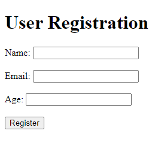

# Migrations and Advanced CRUD Operations on Golang

## Project Overview

This project focuses on implementing advanced CRUD operations and migrations in Golang. The application utilizes PostgreSQL as the chosen database and incorporates tools like golang-migrate and Gorm for managing migrations and ORM (Object-Relational Mapping), respectively.

## Participants

- Ansar Shaumen
- Makar Goryakin
- Amandyk Baktybaiuly

## Screenshot

## Tools Used and Sources

- PostgreSQL: [https://www.postgresql.org/](https://www.postgresql.org/)
- golang-migrate: [https://github.com/golang-migrate/migrate](https://github.com/golang-migrate/migrate)
- Gorm: [https://gorm.io/](https://gorm.io/)
- Gorilla: [https://gorilla.github.io/]( https://gorilla.github.io/)
